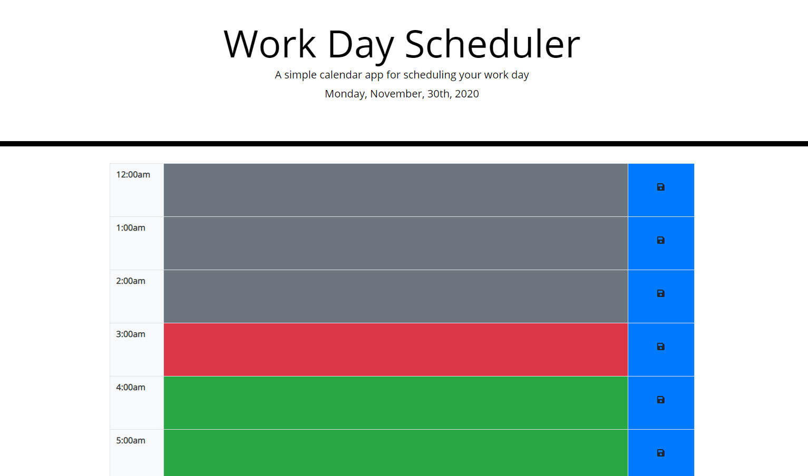
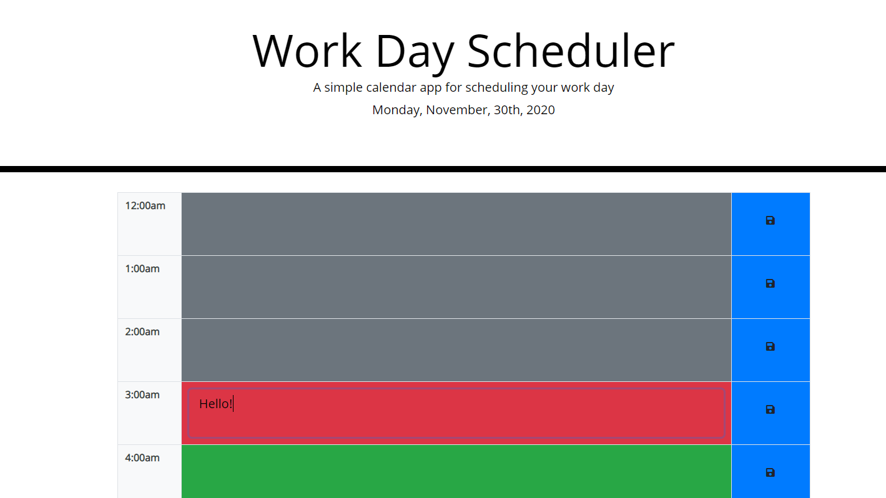
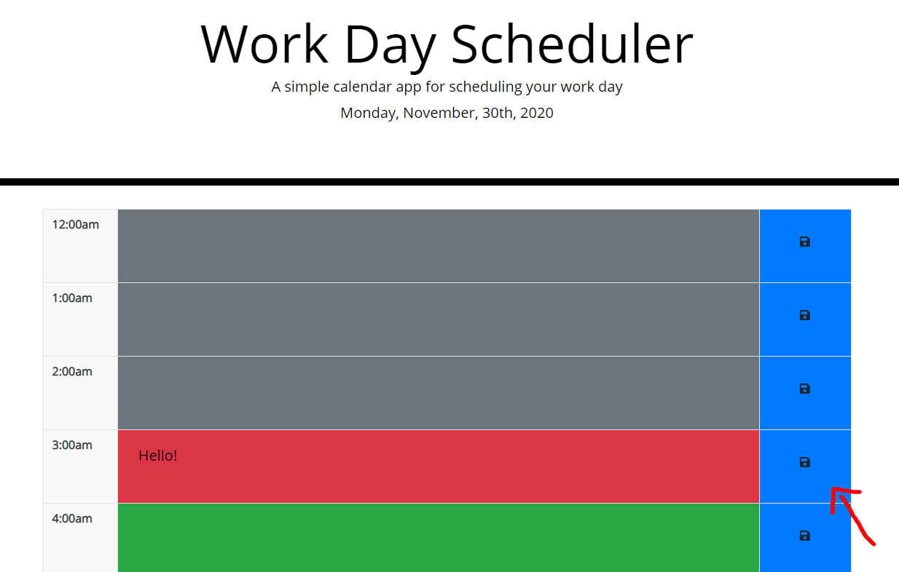

# day-Scheduler
day scheduler


# Description
The main scope of this project is to create a day planner to organize my workday

# User Story
AS A student
I WANT a way to organize my day 
SO THAT I can better schedule my study sessions and classes

## Table of Contents
* [Acceptance Criteria](#Acceptance)
* [Technology](#Technology)
* [Installation](#Installation)
* [Usage](#Usage)
* [Credits](#Credits)
* [License](#License)
* [Review](#Review)


## Acceptance Criteria

```
GIVEN I am using a daily planner to create a schedule
WHEN I open the planner
THEN the current day is displayed at the top of the calendar
WHEN I scroll down
THEN I am presented with timeblocks for standard business hours
WHEN I view the timeblocks for that day
THEN each timeblock is color coded to indicate whether it is in the past, present, or future
WHEN I click into a timeblock
THEN I can enter an event
WHEN I click the save button for that timeblock
THEN the text for that event is saved in local storage
WHEN I refresh the page
THEN the saved events persist
```

## Technology

**HTML**
<br>
**CSS**
<br>
**JS**

## Installation

To publish this web site simply download the files contained in https://github.com/jtrejox/Code-Quiz all the necesary files should be there to publish the website on your prefered web server.

<br>
<br>

## Usage

When you open the page you will be presented with a table containing the hours in a day with the current day displayed in the Jumnbotron


You can click on any of the gray or colored fileds to enter information into them


Click on the blue button to save the information an it will be displayed when you return to the site


To delete contents simply click on the filed you wish to delete, delete the text and save the changes

<Br>
<Br>

## Credits

https://www.w3schools.com/default.asp
https://stackoverflow.com/
https://www.reddit.com/

<Br>
<Br>


## License
MIT License

Copyright (c) [year] [fullname]

Permission is hereby granted, free of charge, to any person obtaining a copy
of this software and associated documentation files (the "Software"), to deal
in the Software without restriction, including without limitation the rights
to use, copy, modify, merge, publish, distribute, sublicense, and/or sell
copies of the Software, and to permit persons to whom the Software is
furnished to do so, subject to the following conditions:

The above copyright notice and this permission notice shall be included in all
copies or substantial portions of the Software.

THE SOFTWARE IS PROVIDED "AS IS", WITHOUT WARRANTY OF ANY KIND, EXPRESS OR
IMPLIED, INCLUDING BUT NOT LIMITED TO THE WARRANTIES OF MERCHANTABILITY,
FITNESS FOR A PARTICULAR PURPOSE AND NONINFRINGEMENT. IN NO EVENT SHALL THE
AUTHORS OR COPYRIGHT HOLDERS BE LIABLE FOR ANY CLAIM, DAMAGES OR OTHER
LIABILITY, WHETHER IN AN ACTION OF CONTRACT, TORT OR OTHERWISE, ARISING FROM,
OUT OF OR IN CONNECTION WITH THE SOFTWARE OR THE USE OR OTHER DEALINGS IN THE
SOFTWARE.

<br><br>

## Review

### Live url: https://jtrejox.github.io/Code-Quiz/
### GitHub url: https://github.com/jtrejox/Code-Quiz

